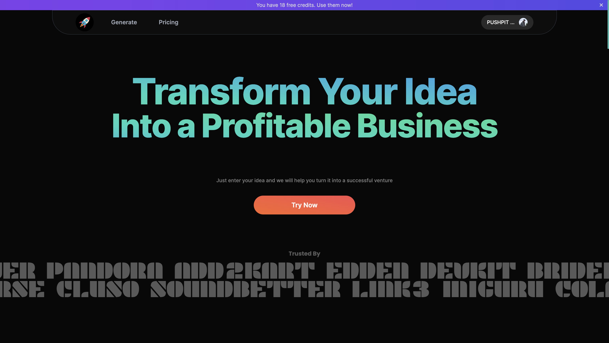

# Idea2Business

Transform your idea into a profitable business. Just enter your idea, and Idea2Business will help you turn it into a successful venture.




<br />

Production: https://idea2business.xyz

Latest Dev Updates: https://idea2business.vercel.app


## Instructions

### Start MongoDB locally

On MacOS: `brew services start mongodb-community`

### Environment Variables

```
Note: .env.example is an example of the secrets file. .env.*.local should be added to .gitignore, as those files are intended to be ignored. .env.development.local is where secrets can be stored.

Defaults are set in .env.example

Create .env.development.local file and replace env variables with your own taking reference from .env.example
```

Environment variables load order- https://nextjs.org/docs/basic-features/environment-variables#environment-variable-load-order

Change env variables on Vercel from CLI- https://vercel.com/docs/cli/env

To turn on dev server-
```sh
npm run dev
```

### Using Docker

Build a docker container- 
```sh
docker-compose up -d --build
```

To turn off dev server-
```sh
docker-compose down
```

Turn on dev server-
```sh
docker-compose up
```

### Stripe

`stripe listen --events checkout.session.completed --forward-to localhost:3000/api/stripe/webhook`

### MongoDB

Dev: https://cloud.mongodb.com/v2/635b891062c3be1fa5989dad#/metrics/replicaSet/635b899be6beb75252ef0fe1/explorer/idea2business/users/find

Prod: https://cloud.mongodb.com/v2/635b891062c3be1fa5989dad#/metrics/replicaSet/637643184127cd4a35093686/explorer/idea2business/users/find


### ReCAPTCHA

https://www.google.com/u/7/recaptcha/admin/site/628283073


### Google Analytics

https://analytics.google.com/analytics/web/?authuser=7#/a263373608p363795173/admin/streams/table/4891232010